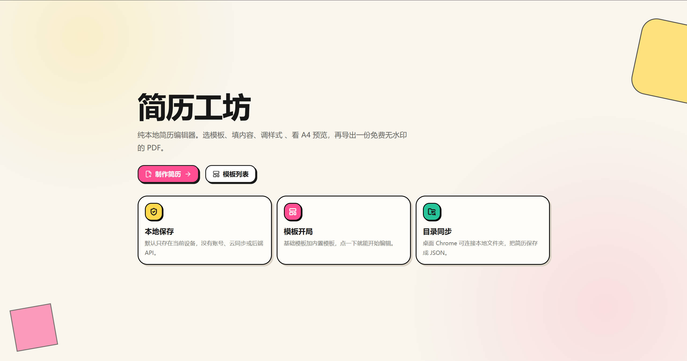
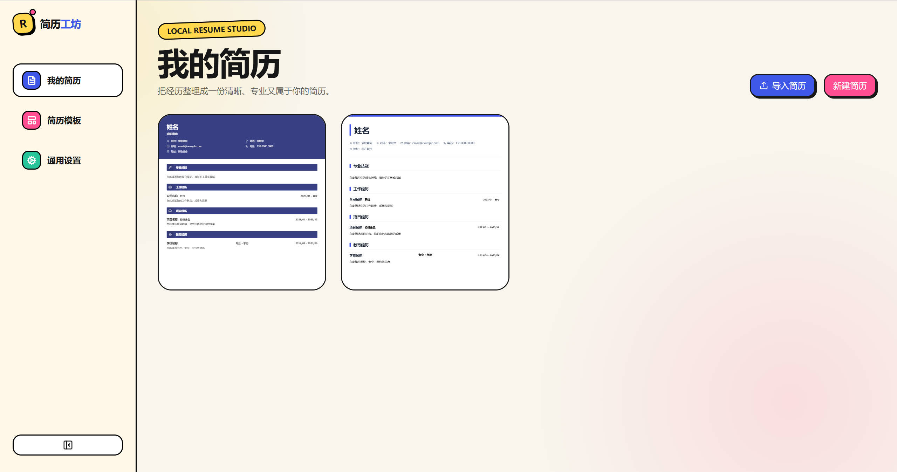
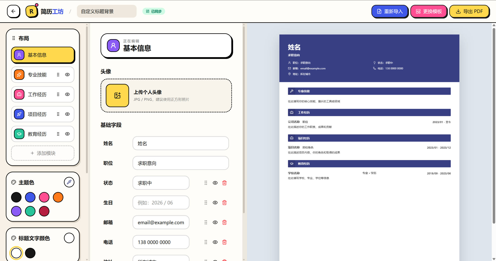
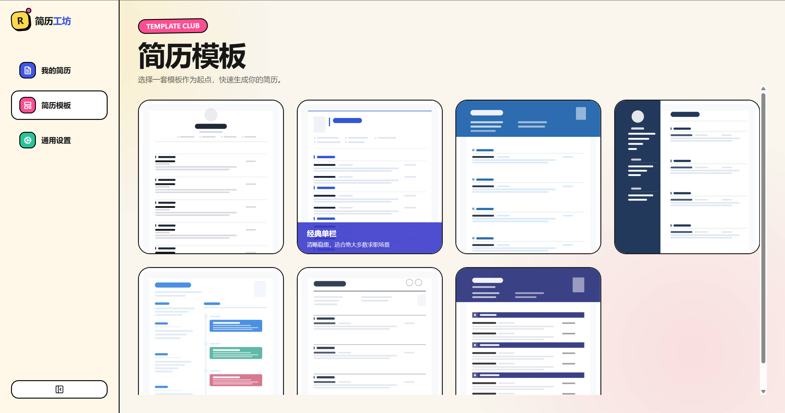

# 简历工坊

一款使用 Next.js 构建的纯本地简历编辑器。应用界面采用活力彩色动漫风，导出的简历保持专业、克制。

# 截图






## 功能

### 简历管理

- **沉浸式首页**：首页使用 `home-hero.mp4` 作为静音循环背景，并通过可读性遮罩、清晰的双入口和语言切换保持操作聚焦；减少动态效果时自动隐藏视频
- **模板选择弹窗**：新建简历时弹出 6 选 1 模板面板（基础模板 + 5 套内置模板），点击即创建
- **PDF 导入简历**：支持文字型 PDF 本地解析，按坐标重建视觉行，结合模块标题的字号/格式形成自上而下的读取范围，并结合行内标题和内容特征识别基本信息、技能、工作、项目和教育模块
- **导入范围确认**：PDF 文本会先整理成内部 Markdown 大纲，按标题顺序确认每个模块的内容范围，再填入表单和模板预览，避免正文续行被误当成新模块或新项目
- **导入结果预览**：导入弹窗中选择目标模板后，会直接预览“识别内容套入当前模板”的效果；若 PDF 文本层存在不可识别字形，会在识别结果顶部提示人工核对日期、邮箱或编号
- 创建、复制、编辑和删除多份简历
- 仪表盘卡片列表，使用连续简历内容生成封面式预览，带骨架屏加载
- 应用内支持中文 / English 切换，语言偏好保存在当前浏览器，刷新与进入编辑器的 loading 状态都会跟随当前语言

### 内容编辑

- **基本信息**：姓名、求职意向、联系方式（手机/邮箱/社交主页等），支持字段显隐与排序
- **专业技能**：富文本段落分点罗列，支持自定义条目
- **工作经历**：公司、职位、时间段、详细描述
- **项目经历**：项目名、角色、时间、职责描述
- **教育经历**：学校、专业学历、时间、补充说明；PDF 导入时会把“全日制 / 非全日制”并入专业学历字段，如 `计算机科学与技术 | 本科 | 非全日制`
- **自定义模块**：可手动添加荣誉证书、自我评价等额外分区
- 全部文本支持 Tiptap 富文本编辑（加粗、颜色、链接、对齐、缩进、列表等）
- 富文本工具栏会随光标所在格式实时高亮；选中文字可通过选区浮层添加、编辑或取消超链接，hover 已有链接可访问、编辑、复制或取消，链接在编辑区与右侧预览中统一显示为蓝色下划线
- 编辑页支持重新导入 PDF 到当前简历，可重新选择目标模板并保留当前简历 ID

### 排版与样式

- 模块显隐、拖拽排序
- 全局主题色、字体风格（清晰黑体 / 优雅宋体 / 圆润字体）
- 字号、行高、页边距、模块间距可调，右侧简历预览实时联动
- 条目级背景颜色仅在时间轴色块模板下显示，用于控制时间轴卡片颜色

### 模板系统

- **6 套简历模板**：
  - 基础模板 —— 水平分割线 + 居中头部，从零自由填写
  - 经典单栏 —— 左侧色条标题，稳重通用
  - 蓝色头部单栏 —— 全宽深色头部，适合产品/技术岗
  - 深色侧边栏双栏 —— 左侧深色信息栏 + 右侧主内容
  - 时间轴色块 —— 左侧信息列 + 右侧时间线色块
  - 复古分割线 —— 分段线分隔模块，适合传统行业
- 所有模板的默认姓名、联系方式、经历等预设信息统一参考基础模板，只保留各自的布局与样式差异
- 新建简历会根据当前界面语言生成中文或英文默认标题、字段和示例内容，已有简历不会被自动翻译或改写
- 模板缩略图使用轻量骨架预览；模板库与新建简历弹窗统一为暗色封面卡，hover/focus 时从底部滑出模板标题和描述
- 编辑页支持更换当前简历模板，只替换布局与样式，保留已填写内容
- `/templates` 模板库页面，支持封面式骨架预览和一键使用

### 预览与导出

- A4 连续流式实时预览，红色虚线标识分页位置
- 响应式缩放（移动端 0.46x → 大屏 1x）
- 右侧预览会按当前语言显示固定模块标题和基础信息标签，用户填写内容保持原文；PDF 导出跟随右侧预览
- 导出菜单提供视觉版 PDF（html-to-image + jsPDF，保留截图式视觉一致性、可点击链接与完整回导数据）和打印 / 文字 PDF（浏览器原生打印视图，正文可搜索、复制；长经历允许自然续页，避免大面积留白）
- 所有模板的基础字段统一以“字段名：值”呈现；文字版 PDF 的字段名使用清晰的中文无衬线字体与实色绘制，避免与超链接值混排时变模糊
- PDF 切片边界智能避让文字行、标题和图片
- PDF 导出按实际内容底部计算切片范围，避免把预览尾部空白导出成额外空白页

### 本地存储

- IndexedDB 浏览器本地缓存，所有数据仅存于当前设备
- 桌面 Chrome 支持 File System Access API 连接本地目录
- 简历同步为 `{标题}-{id}.json` 文件，带 `lastModified` 冲突检测
- 新建/导入/复制后实时写入目录；删除后同步清理目录文件；标题变更时自动重命名
- 目录断开不删除已有文件

### 响应式

- 桌面三栏编辑工作台（样式面板 / 内容编辑 / 实时预览）
- 移动端底部 Tab 切换（内容 / 样式 / 预览）

### 隐私

- 无账号系统
- 无后端 API
- 无云同步
- 无 AI 服务
- 无遥测追踪

## 开发

```bash
npm install
npm run dev      # 启动开发服务器 (Turbopack, 默认端口 3000)
npm run build    # 生产构建
npm run start    # 启动生产服务器
npm run lint     # ESLint
npm run typecheck # TypeScript 类型检查 (tsc --noEmit)
```

## 技术栈

Next.js 16 (App Router) / React 19 / TypeScript / Tailwind CSS 4 / Radix UI Primitives / Zustand 5 / Zod 4 / Tiptap 3 / idb / jsPDF + html-to-image / Lucide React

## UI 组件策略

- `anime-ui` 负责项目漫画风外观，包括黑色描边、硬阴影、彩色强调和基础按钮/卡片/弹窗样式。
- `InkButton` 是统一按钮入口，支持尺寸、图标按钮、加载态、hover 图标转文字、`unstyled` 无默认视觉模式和 danger/ghost 等语义变体；内部使用 `tailwind-merge`，默认样式允许被后续 `className` 的同类 Tailwind 样式覆盖；base 不默认带边框、阴影或位置移动，`ghost` 不设置默认 hover 背景，弹窗关闭、Toast 关闭、仪表盘卡片操作和编辑器条目操作等高频图标按钮已统一走 `size="icon"`。
- 需要漫画硬阴影的 `InkButton` 调用点应显式添加对应 `shadow-[...]` 样式，不依赖组件尺寸默认值。
- `InkButton` 的 `pressable` 配置用于显式开启点击按压态，应用 `active:translate-x-0.5 active:translate-y-0.5 active:shadow-none`。
- `InkButton` 的 `unstyled` 配置用于迁移已有原生按钮：只复用按钮组件能力，不注入默认尺寸、颜色、阴影或字体样式；`hoverLabel` 用于 icon-only 状态下 hover/focus 时将图标切换为文字。
- Radix UI Primitives 只作为交互底座使用，当前用于 Dialog、Popover、Select、Tabs 和 Tooltip 的焦点管理、Escape、外部点击、键盘操作与 Portal 定位，不引入默认视觉样式。
- 编辑器工作台壳层、样式面板、自定义模块编辑器和仪表盘卡片列表已按职责拆分，保持现有外观、业务入口和交互语义不变。
- 需要定位页面或业务组件时，先查阅 [组件地图](docs/component-map.md)；可复用与业务组件的导出声明前均有职责注释。

## 兼容性

- 所有现代浏览器：完整编辑与 IndexedDB 存储
- 桌面 Chrome（最新版）：额外支持本地目录同步 (File System Access API)
- 需 HTTPS 或 localhost 安全上下文

## 验证

```bash
npm run typecheck
npm run lint
npm run build
```
